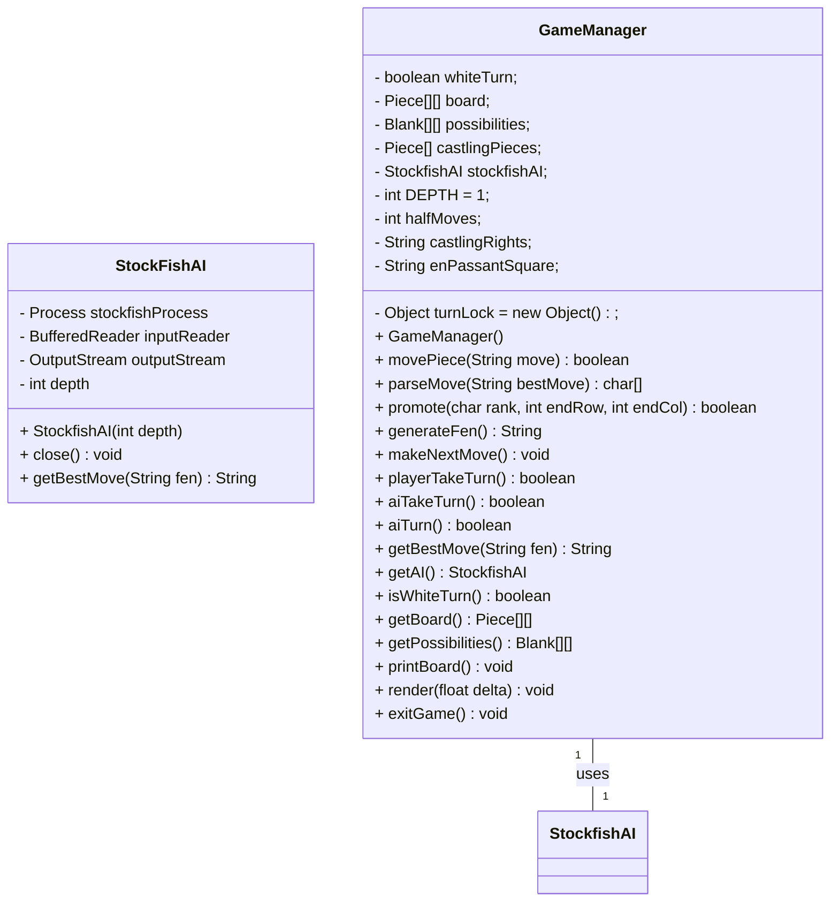

# Game Room GDX

```mermaid 
classDiagram
    class StockFishAI{
        - Process stockfishProcess
        - BufferedReader inputReader
        - OutputStream outputStream
        - int depth
        + StockfishAI(int depth)
        + close() void
        + getBestMove(String fen) String
    }
      class GameManager{
       - Object turnLock = new Object();
       - boolean whiteTurn;
       - Piece[][] board;
       - Blank[][] possibilities;
       -  Piece[] castlingPieces;
       - StockfishAI stockfishAI;
       - int DEPTH = 1;
       - int halfMoves;
       - String castlingRights;
       - String enPassantSquare;
       + GameManager()
       + movePiece(String move) boolean
       + parseMove(String bestMove) char[]
       + promote(char rank, int endRow, int endCol) boolean
       + generateFen() String
       + makeNextMove() void
       + playerTakeTurn() boolean
       + aiTakeTurn() boolean
       + aiTurn() boolean
       + getBestMove(String fen) String
       + getAI() StockfishAI
       + isWhiteTurn() boolean
       + getBoard() Piece[][]
       + getPossibilities() Blank[][]
       + printBoard() void
       + render(float delta) void
       + exitGame() void
   
   }
   GameManager "1" -- "1" StockfishAI : uses


```