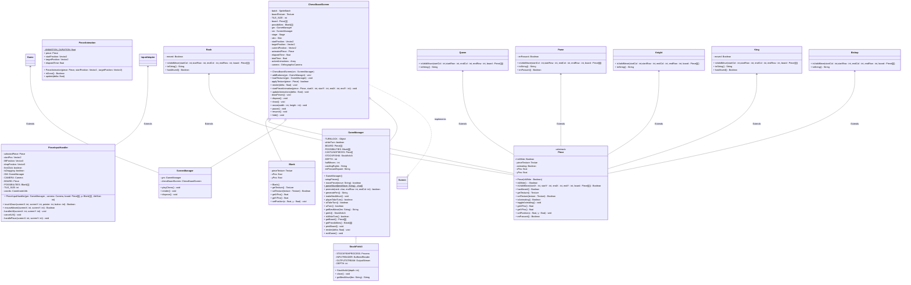

# Game Room GDX

```mermaid 
classDiagram
    class StockFishAI{
        - STOCKFISHPROCESS: Process
        - INPUTREADER: BufferedReader
        - OUTPUTSTREAM: OutputStream
        - DEPTH: int
        + StockfishAI(depth: int)
        + close() void
        + getBestMove(fen: String) String
    }
    
    class GameManager{
       - TURNLOCK : Object 
       - whiteTurn: boolean 
       - BOARD: Piece[][] 
       - POSSIBILITIES: Blank[][]
       - CASTLINGPIECES: Piece[] 
       - STOCKFISHAI: StockfishAI 
       - DEPTH : int
       - halfMoves : int
       - castlingRights : String
       - enPassantSquare: String
       + GameManager()
       - setupPieces()
       + movePiece(move: String) boolean
       + parseMove(bestMove: String) char[]$
       + promote(rank: char, endRow: int, endCol: int) boolean
       + generateFen() String
       + makeNextMove() void
       + playerTakeTurn() boolean
       + aiTakeTurn() boolean
       + aiTurn() boolean
       + getBestMove(fen: String) String
       + getAI() StockfishAI
       + isWhiteTurn() boolean
       + getBoard() Piece[][]
       + getPossibilities() Blank[][]
       + printBoard() void
       + render(delta: float) void
       + exitGame() void
   
   }
    GameManager  o--  StockFishAI
    
    class ScreenManager{
        - gm: GameManager
        - chessBoardScreen: ChessBoardScreen
        
        + playChess() void
        + render() void
        + dispose() void
    }
    
    class Game{
        
    }
    
    Game <-- ScreenManager: Extends
    
    class PieceAnimation{
        - ANIMATION_DURATION: float$
        + piece: Piece
        + startPosition: Vector2
        + targetPosition: Vector2
        + elapsedTime: float
        
        + PieceAnimation(piece: Piece, startPosition: Vector2 , targetPosition: Vector2)
        + isDone() Boolean
        + update(delta: float)
    }
    
    class InputAdapter{
        
    }
    
    class PieceInputHandler{
        - selectedPiece: Piece
        - startPos: Vector2
        - liftPosition: Vector3
        - dropPostion: Vector3
        - firstClick: boolean
        - isDragging: boolean
        
        - GM: GameManager
        - CAMERA: Camera
        - BOARD: Piece
        - POSSIBILITIES: Blank[][]
        - TILE_SIZE: int
        
        - coords: CoordinateUtils
        
        + PieceInputHandler(gm: GameManager , camera: Camera, board: Piece[][], p: Blank[][] , tileSize: int)
        + touchDown(screenX: int, screenY: int, pointer: int, button: int) Boolean
        + mouseMoved(screenX: int, screenY: int) Boolean
        - handleLift(screenX: int, screenY: int) void
        - cancelLift() void
        - handlePlace(screenX: int, screenY: int) void
    }
    
    InputAdapter <-- PieceInputHandler: Extends
    class Piece{
        <<abstract>>
        # isWhite: Boolean
        - pieceTexture: Textue
        - animating: Boolean
        - xPos: float
        - yPos: float
        
        + Piece(isWhite : Boolean)
        + isWhite() : Boolean
        + isValidMove(startX : int, startY : int, endX : int, endY : int, board : Piece[][]) Boolean
        + hasMoved() Boolean
        + getTexture() Texture
        + setTexture(texture : Texture) Boolean
        + isAnimating() Boolean
        + toggleAnimating() void
        + getXPos() float
        + getYPos() float
        + setPosition(x : float, y : float) void
        + enPassant() Boolean
    
    }
    class Bishop{
    
        + isValidMove(startCol : int,startRow : int, endCol : int, endRow : int, board : Piece[][])
        + toString() String
    }
     class King{
        - moved: Boolean
        
        + isValidMove(startCol : int,startRow : int, endCol : int, endRow : int, board : Piece[][])
        + toString() String
        + hasMoved() Boolean
    }
     class Knight{
        + isValidMove(startCol : int,startRow : int, endCol : int, endRow : int, board : Piece[][])
        + toString() String
    }
     class Pawn{
       - enPassant: Boolean
       
       + isValidMove(startCol : int,startRow : int, endCol : int, endRow : int, board : Piece[][])
       + toString() String
       + enPassant() Boolean
    }
     class Queen{
        + isValidMove(startCol : int,startRow : int, endCol : int, endRow : int, board : Piece[][])
        + toString() String
    }
    class Rook{
        - moved: Boolean
        
        + isValidMove(startCol : int,startRow : int, endCol : int, endRow : int, board : Piece[][])
        + toString() String
        + hasMoved() Boolean
    
    }
    Bishop <-- Piece: Extends
    King <-- Piece: Extends
    Knight <-- Piece: Extends
    Pawn <-- Piece: Extends
    Queen <-- Piece: Extends
    Rook <-- Piece: Extends
    class Blank{
      - pieceTexture: Textue
      - xPos: float
      - yPos: float
      
      + Blank()
      + getTexture() Texture
      + setTexture(texture : Texture) Boolean
      + getXPos() float
      + getYPos() float
      + setPosition(x : float, y : float) void
    
    }
    class ChessBoardScreen{
        - batch : SpriteBatch
        - boardTexture : Texture
        - TILE_SIZE : int
        - board : Piece[][]
        - possibilities : Blank[][]
        - gm : GameManager
        - sm : ScreenManager
        - stage : Stage
        - skin : Skin
        - startPosition : Vector2
        - targetPosition : Vector2
        - currentPosition : Vector2
        - animatedPiece : Piece
        - elapsedTime : float
        - totalTime : float
        - activeAnimations : Array<PieceAnimation>
        - camera : OrthographicCamera

        + ChessBoardScreen(sm : ScreenManager)
        + addButtons(gm : GameManager) void
        + loadTextures(gm : GameManager) void
        - applyTexture(piece : Piece) boolean
        + render(delta : float) void
        + startPieceAnimation(piece : Piece, startX : int, startY : int, endX : int, endY : int) void
        + updateAnimations(delta : float) void
        - drawPieces() void
        + dispose() void
        + show() void
        + resize(width : int, height : int) void
        + pause() void
        + resume() void
        + hide() void
    
    }
    ChessBoardScreen ..|> Screen : implements
    ChessBoardScreen o-- GameManager
    ChessBoardScreen o-- ScreenManager
    ChessBoardScreen o-- Piece
    ChessBoardScreen o-- Blank

```