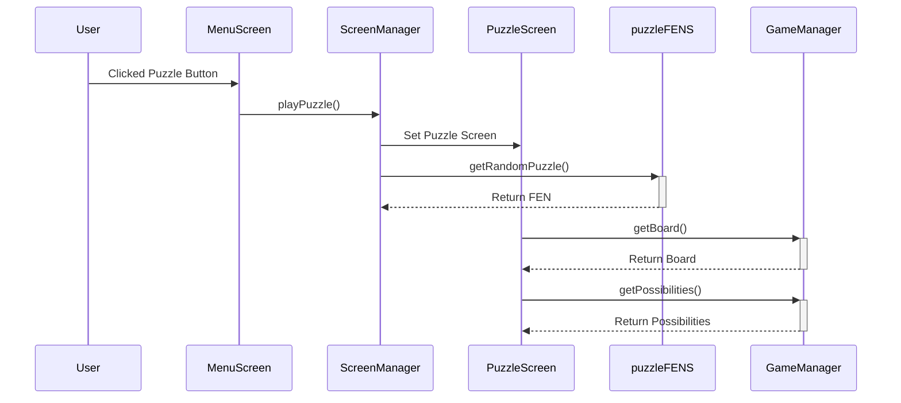

# Game Room GDX

```mermaid 
sequenceDiagram
    participant User
    participant MenuScreen
    User ->> MenuScreen: Clicked Puzzle Button
    participant ScreenManager
    MenuScreen ->> ScreenManager: playPuzzle()
    participant PuzzleScreen
    ScreenManager ->> PuzzleScreen: Set Puzzle Screen
    participant puzzleFENS
    ScreenManager ->> + puzzleFENS: getRandomPuzzle()
    puzzleFENS -->> - ScreenManager: Return FEN
    participant GameManager
    PuzzleScreen ->> + GameManager: getBoard()
    GameManager -->> - PuzzleScreen: Return Board
    PuzzleScreen ->> + GameManager: getPossibilities()
    GameManager -->> - PuzzleScreen: Return Possibilities
    

```
The sequence diagram illustrates the process of a user clicking on the puzzle button.  
The Game will set up a puzzle board and load the required assets. 