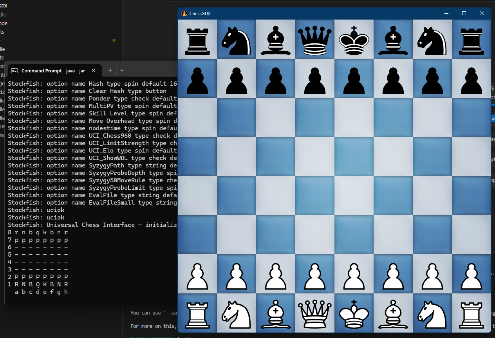

# ChessGDK

ChessGDK is a 2D Chess Game application developed in Java, featuring an interactive user interface and an AI-powered opponent. Designed for simplicity, flexibility, and cross-platform compatibility, this project is easily extendable with new features. The graphical user interface (GUI) is built using [LibGDX](https://libgdx.com/), creating a visually appealing and responsive chessboard for player interaction. Core game logic, including piece movement, turn-based play, and move validation, is encapsulated in a dedicated logic layer for clean separation of concerns.

This project was initialized as a [libGDX](https://libgdx.com/) project using [gdx-liftoff](https://github.com/libgdx/gdx-liftoff).

## Proof of Concept

<p align="center">
    
</p>

## Software Architecture

- **Programming Language:** Java (JDK 21)
- **Framework:** LibGDX (Java Game API)
- **Platform Compatibility:** Windows, macOS, and Linux

## External Dependencies

This project uses the Stockfish chess engine for AI moves, integrated as an external executable. If you’re running the project on an OS other than Windows, download the Stockfish engine for that OS, place it in the `assets` folder, and update the path to the `.exe` in the `StockfishAI` class.

---

## Getting Started

You can start ChessGDK either by downloading a release or by cloning the repository.

### Option 1: Release

1. **Download the latest release** from the Releases section on GitHub.
2. **Unzip the folder** to your desired location.

### Option 2: Clone the Repository

1. **Clone this repository** to your desired folder:
   ```bash
   git clone https://github.com/cis3296f24/project-04-gameroomgdx
   ```

---

## Running the Game

### Running from JAR

1. **Install Java SDK 21** if not already installed.
   - Ensure the `JAVA_HOME` environment variable is set to the SDK 21 installation directory.

2. **Build the JAR** by running the following command in the project root:
   ```bash
   ./gradlew jar
   ```

3. **Run the JAR** from any location on your system:
   ```bash
   java -jar path/to/ChessGDK.jar
   ```

### Running with an IDE or Terminal

1. **Install Java SDK 21** if not already installed.
   - Ensure the `JAVA_HOME` environment variable is set to the SDK 21 installation directory.

2. **Set Up Your IDE** (IntelliJ IDEA or VSCode):
   - **IntelliJ IDEA**: Open the project, and the IDE will automatically recognize the Gradle configuration and resolve dependencies.
   - **VSCode**: Open the project and install the Java Extension Pack if needed.

3. **Build and Run**:
   - Use the Gradle interface in the IDE to build and run the project, or run from the terminal:
     ```bash
     ./gradlew run
     ```
