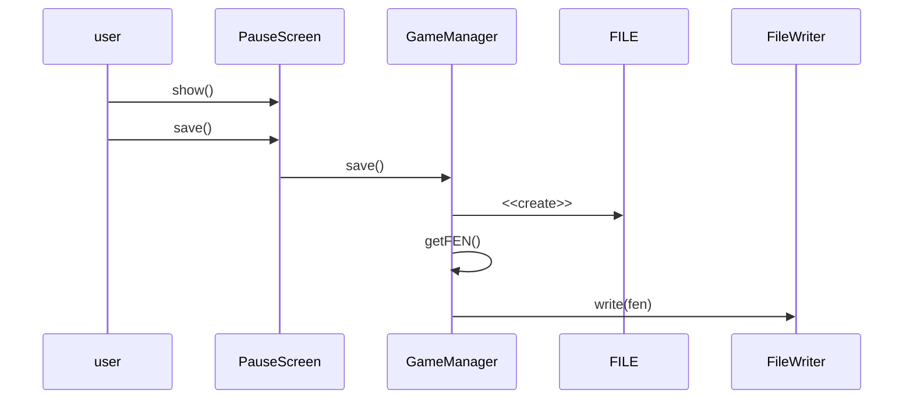

# Game Room GDX

The above sequence diagram details the process of creating a save state. The user hits
the save button in the puase manu and the game manager will write the current fen to a new file.

